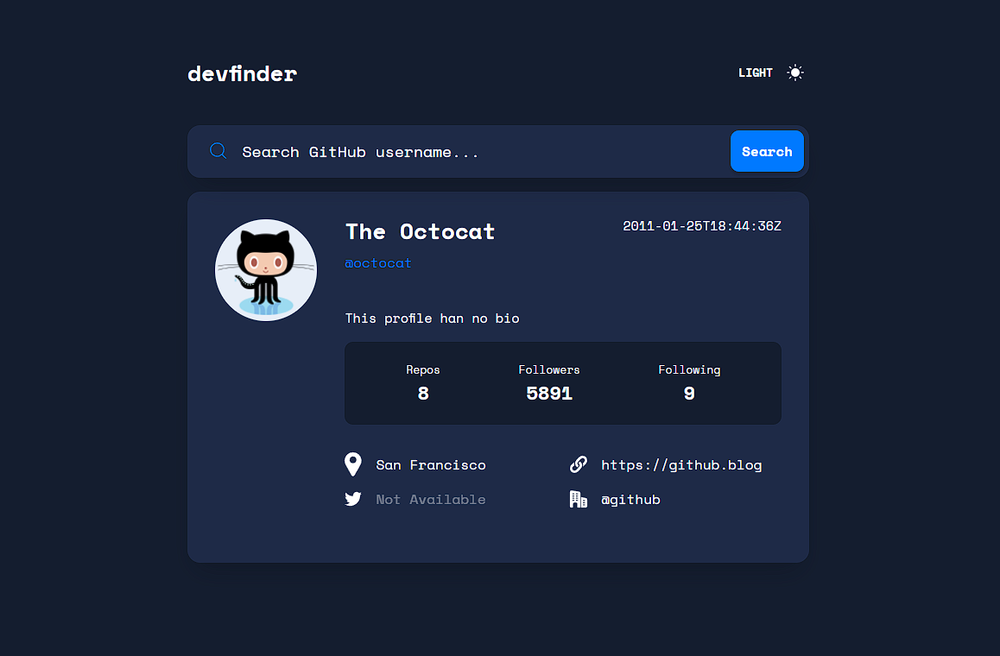

# GitHub user search app

This is a solution to the [GitHub user search app challenge on Frontend Mentor](https://www.frontendmentor.io/challenges/github-user-search-app-Q09YOgaH6).

## :beginner: Overview

[View demo](https://davitjabushanuri.github.io/github-user-search-app/)

## :camera:



## :zap: Usage

Users should be able to:

- View the optimal layout for the app depending on their device's screen size
- See hover states for all interactive elements on the page
- Search for GitHub users by their username
- See relevant user information based on their search
- Switch between light and dark themes

### :notebook: Pre-Requisites

To get a local copy up and running follow these simple example steps.

- [git](https://git-scm.com/)
- [NodeJS](https://nodejs.dev/)
- [npm](https://npmjscom/)

### :electric_plug: Installation

After you've made sure to have all the tools installed, you should be able to just run a few commands to get set up

```
git clone https://github.com/davitJabushanuri/github-user-search-app.git
cd github-user-search-app
npm install
npm start
```

### :hammer: Built With

- [React](reactjs.org)
- [Sass](https://sass-lang.com/)
- [Flexbox](https://css-tricks.com/snippets/css/a-guide-to-flexbox/)
- [Grid](https://css-tricks.com/snippets/css/complete-guide-grid/)

## :book: What I learned

Handle errors manually with fetch calls

```
const data = await fetch(`https://api.github.com/users/${input}`)
const user = await data.json()
if (user.message) {
setError(true)
return
}
setUser(user)
```

### :house: Development

- Add animations
- Have the correct color scheme chosen for users based on their computer preferences(prefers-color-scheme).

### 🤝 Contribution

Your contributions are always welcome and appreciated. Following are the things you can do to contribute to this project.

- **Report a bug**
  If you think you have encountered a bug, feel free to report it [here](https://github.com/davitJabushanuri/github-user-search-app/issues).
  <br/>
- **Request a feature**
  If you have a suggestion that would make this better, You can request for a feature [here](https://github.com/davitJabushanuri/github-user-search-app/issues) with the tag "enhancement".
  <br/>

- **Create a pull request**

  1. Fork the Project
  2. Create your Feature Branch (`git checkout -b feature/AmazingFeature`)
  3. Commit your Changes (`git commit -m 'Add some AmazingFeature'`)
  4. Push to the Branch (`git push origin feature/AmazingFeature`)
  5. Open a Pull Request
     <br/>

> If you are new to open-source, make sure to check read more about it [here](https://www.digitalocean.com/community/tutorial_series/an-introduction-to-open-source) and learn more about creating a pull request [here](https://www.digitalocean.com/community/tutorials/how-to-create-a-pull-request-on-github).

## :star2: Acknowledgment

- [Frontend Masters](https://www.frontendmentor.io/home)
- [React](reactjs.org)

### 📝 License

This project is [MIT](https://github.com/davitJabushanuri/readme/blob/master/LICENSE) licensed.
